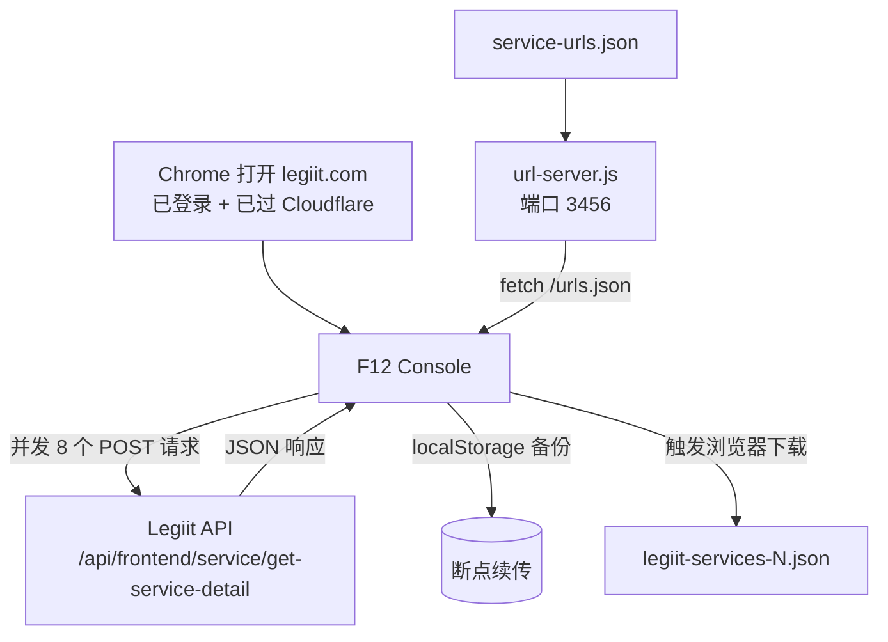

# Legiit 服务数据 — 拉取、存储与展示流程

## 概述

从 [Legiit.com](https://legiit.com) 爬取所有服务数据（20,729 条），根据评论数排名，在页面中展示 Top 100 及全量搜索浏览功能。

---

## 第一阶段：数据拉取（Scraping）

目标：从 Legiit 获取所有服务的详细信息（评分、评论数、价格、卖家、分类等）。

### 核心文件

| 文件 | 用途 |
|------|------|
| `src/lib/legiit/url-server.js` | 本地 HTTP 服务器，提供预存的 URL 列表 |
| `src/lib/legiit/service-urls.json` | 所有服务的 `{username, seo_url}` 列表（20,729 条） |
| `src/lib/legiit/console-script-v3.js` | 在 Chrome 控制台运行的提取脚本（断点续传、并发、Session 过期检测） |
| `src/lib/legiit/console-script-v2.js` | v2 版本 |
| `src/lib/legiit/console-script.js` | 初始版本 |
| `src/lib/legiit/download-script.js` | 纯下载 localStorage 备份的简易脚本 |

### 执行步骤



#### 详细操作

1. **启动本地 URL 服务**
   ```bash
   node src/lib/legiit/url-server.js
   ```
   服务运行在 `http://127.0.0.1:3456/urls.json`，提供 20,729 个服务的 URL 列表。

2. **打开 Legiit.com**
   在 Chrome 中访问 `https://legiit.com`，确保已登录并成功通过 Cloudflare 验证。

3. **注入提取脚本**
   按 F12 打开开发者工具 → Console 选项卡，粘贴 `console-script-v3.js` 全部内容回车运行。

4. **脚本自动执行**

   | 步骤 | 说明 |
   |------|------|
   | 获取 URL 列表 | 从本地服务 `http://127.0.0.1:3456/urls.json` 获取所有 `{username, seo_url}` |
   | 检查备份 | 读取 `localStorage` 判断是否有已完成的数据，实现断点续传 |
   | 并发请求 | 以 **8 个并发** 调用 Legiit 内部 API（POST 方式） |
   | 进度显示 | 实时进度条、速度（个/秒）、预计剩余时间、错误数 |
   | Session 检测 | 连续 5 次 403 自动暂停，提示用户按 F5 刷新页面获取新 Cookie |
   | 自动备份 | 每 50 条备份到 `localStorage`，防止意外丢失 |
   | 完成下载 | 全部抓取完成后自动触发浏览器下载 JSON 文件 |

5. **API 请求细节**
   - **接口**: `POST https://legiit.com/api/frontend/service/get-service-detail`
   - **请求头**: `Content-Type: application/json`, `X-Requested-With: XMLHttpRequest`
   - **请求体**: `{ "seo_url": "...", "username": "..." }`
   - **认证**: `credentials: 'include'`（依赖浏览器 Cookie）

6. **数据提取字段**

   从 API 响应中提取以下字段并映射为压缩字段名：

   | 压缩字段 | 含义 | 来源路径 |
   |----------|------|----------|
   | `u` | 卖家用户名 | `d.user.username` |
   | `s` | SEO URL | `d.seo_url` |
   | `t` | 服务标题 | `d.title` |
   | `r` | 服务评分 | `d.service_rating` |
   | `rc` | 总评论数 | `d.total_review_count` |
   | `bp` | 基础套餐价 | `d.basic_plans[0].price` |
   | `sp` | 标准套餐价 | `d.standard_plans[0].price` |
   | `pp` | 高级套餐价 | `d.premium_plans[0].price` |
   | `l` | 卖家等级 | `d.user.seller_level` |
   | `cat` | 分类名称 | `d.category.category_name` |
   | `sub` | 子分类名称 | `d.subcategory.subcategory_name` |
   | `sr` | 卖家总评论 | `d.user.user_details.total_review` |
   | `cr` | 创建时间 | `d.created_at` |

### 断点续传机制

- **备份位置**: 浏览器 `localStorage`，key 为 `legiit_services_backup`
- **恢复逻辑**: 脚本启动时读取备份，通过 `seo_url` 去重，跳过已完成的
- **手动保存**: 随时在控制台输入 `saveProgress()` 下载当前进度
- **失败重试**: 完成后输入 `retryFailed()` 重试失败的条目

---

## 第二阶段：数据存储

### JSON 文件位置

```
src/data/legiit-services.json
```

### 文件结构

```json
{
  "total": 20729,
  "generated_at": "2026-07-12T06:15:47.670Z",
  "services": [
    {
      "u": "RealAuthority",
      "s": "outreach-from-real-sites-permanent-premium-niche-specific-links",
      "t": "REAL WEBSITE Outreach Links - Ranking Quality",
      "r": 4.9288,
      "rc": 3625,
      "bp": 15,
      "sp": 139,
      "pp": 259,
      "l": "Level 4",
      "cat": "SEO",
      "sub": "Niche Edits",
      "sr": 4037,
      "cr": ""
    }
    // ... 共 20,729 条
  ]
}
```

> **字段压缩原因**: JSON 文件约 **30MB**，使用短字段名（`u`/`s`/`t` 等）可显著减小文件体积。

### 类型定义

文件: `src/types/legiit.ts`

```typescript
// JSON 中的压缩字段
interface LegiitService {
  u: string;    // username
  s: string;    // seo_url
  t: string;    // title
  r: number | null;   // service_rating
  rc: number | null;  // total_review_count
  bp: number | null;  // basic_plan_price
  sp: number | null;  // standard_plan_price
  pp: number | null;  // premium_plan_price
  l: string;   // seller_level
  cat: string; // category_name
  sub: string; // subcategory_name
  sr: number | null;  // seller_total_review
  cr: string;  // created_at
}

// UI 展示用的展开字段
interface LegiitServiceDisplay {
  rank: number;
  username: string;
  seoUrl: string;
  title: string;
  rating: number | null;
  reviewCount: number | null;
  basicPrice: number | null;
  standardPrice: number | null;
  premiumPrice: number | null;
  sellerLevel: string;
  category: string;
  subcategory: string;
  sellerTotalReviews: number | null;
  createdAt: string;
  url: string;
}
```

### 数据加载方式

```typescript
// src/lib/legiit/data.ts
import rawData from "@/data/legiit-services.json";
const data = rawData as LegiitData;
```

Next.js 自动处理静态 JSON 的导入和打包。

---

## 第三阶段：数据展示

### 架构图

```
src/data/legiit-services.json
         ↓ import
src/lib/legiit/data.ts  ← 数据处理层
    ├── getTopServices(100)      → 按评论数排序，取 Top 100
    ├── getOverviewStats()       → 总览统计数据
    ├── getCategoryStats()       → 分类分布统计
    ├── getAllServices()         → 全部原始数据（客户端搜索用）
    ├── searchServices(query)    → 搜索前 50 条
    └── getServicesPage(page)    → 分页数据
         ↓
src/app/legiit/page.tsx  ← 页面组装（服务端组件）
    ├── StatCard × 4            → 总览统计卡片
    ├── CategoryBar × N         → 分类条形图
    ├── LegiitTop100            → Top 100 排名表（服务端组件）
    └── LegiitServiceList       → 全量搜索浏览（客户端组件）
```

### 页面渲染结构

```
┌─ Header（标题 + 数据来源说明）──────────────────────┐
├─ Stats Cards（4 个总览统计卡片）──────────────────────┤
│  Total Services: 20,729                            │
│  Total Reviews: (所有服务评论总和)                     │
│  Avg. Rating: 4.82 ★                               │
│  Avg. Starting Price: $24.50                        │
├─ Category Breakdown（分类条形图）─────────────────────┤
│  SEO          ████████████████  8,234               │
│  Social Media ██████████        3,456               │
│  ...                                               │
├─ 🏆 Top 100 — Most Reviewed Services ──────────────┤
│  # │ Service            │ Seller    │ $  │ Rating   │
│  1 │ REAL WEBSITE Outr… │ RealAuth… │ $15│ ★★★★…   │
│  2 │ Create 10,000 Dof… │ seolinks… │ $6 │ ★★★★…   │
│  ... (前 100 名)                                    │
├─ 📋 All Services（全量搜索与浏览）─────────────────────┤
│  [Search...]  [Sort by Reviews ↓]                  │
│  Showing 1–50 of 20,729 services                   │
│  ← Prev  1 2 3 4 ... 415  Next →                  │
└─────────────────────────────────────────────────────┘
```

### 核心数据处理函数

| 函数 | 位置 | 说明 |
|------|------|------|
| `getTopServices(n)` | `data.ts:34` | 按评论数降序排列，取前 n 条，展开为 `LegiitServiceDisplay` |
| `getOverviewStats()` | `data.ts:58` | 计算总数、总评论数、平均评分、平均起价 |
| `getCategoryStats()` | `data.ts:98` | 按分类聚合数量、平均价格、总评论数 |
| `getAllServices()` | `data.ts:121` | 返回原始数据（供客户端组件使用） |
| `searchServices(query)` | `data.ts:80` | 按标题/卖家/分类模糊搜索，取前 50 条 |
| `getServicesPage(page)` | `data.ts:40` | 分页返回（按评论数排序） |

### 展示组件

#### 1. LegiitTop100（服务端组件）

- **文件**: `src/components/LegiitTop100.tsx`
- **功能**: 静态表格展示 Top 100 服务
- **特性**:
  - 排名徽章（🏅 第 1 名金色、第 2 名银色、第 3 名铜色）
  - 星级评分展示（实心星 + 半星）
  - 价格展示
  - 卖家等级颜色标记（Level 1-4 不同颜色）
  - 分类 + 子分类显示
  - 点击标题跳转到 Legiit 详情页

#### 2. LegiitServiceList（客户端组件）

- **文件**: `src/components/LegiitServiceList.tsx`
- **标记**: `"use client"`（浏览器端交互）
- **功能**: 全量服务搜索、排序、分页
- **交互特性**:
  - 🔍 **搜索**: 按标题、卖家、分类、子分类模糊搜索
  - 📊 **排序**: 按评论数降序、价格升序、评分降序
  - 📄 **分页**: 每页 50 条，共约 415 页
  - 🔗 **链接**: 每条服务可点击跳转到 Legiit 详情页

### 主页面

- **文件**: `src/app/legiit/page.tsx`
- **路由**: `/legiit`
- **Meta**: title = "Legiit Services - Top 100 Rankings"
- **数据获取**: 服务端直接调用 `data.ts` 的函数（Next.js 服务端组件）

---

## 完整文件清单

```
src/
├── app/legiit/page.tsx              # 主页面
├── types/legiit.ts                  # 类型定义
├── data/legiit-services.json        # 拉取的 JSON 数据 (20,729 条)
├── components/
│   ├── LegiitTop100.tsx             # Top 100 展示组件
│   └── LegiitServiceList.tsx        # 全量搜索浏览组件
└── lib/legiit/
    ├── data.ts                      # 数据加载与处理
    ├── url-server.js                # 本地 URL 服务
    ├── console-script-v3.js         # 提取脚本 v3（推荐使用）
    ├── console-script-v2.js         # 提取脚本 v2
    ├── console-script.js            # 提取脚本 v1
    ├── download-script.js           # 简易下载脚本
    ├── extract-urls.js              # URL 提取工具
    ├── scraper.ts                   # Playwright 爬虫（备选方案）
    ├── scraper-full.ts              # Playwright 完整爬虫
    ├── scraper-test.ts              # 爬虫测试
    ├── types.ts                     # lib 内部类型
    └── test-*.js / test-*.ts        # 各种调试测试脚本
```
